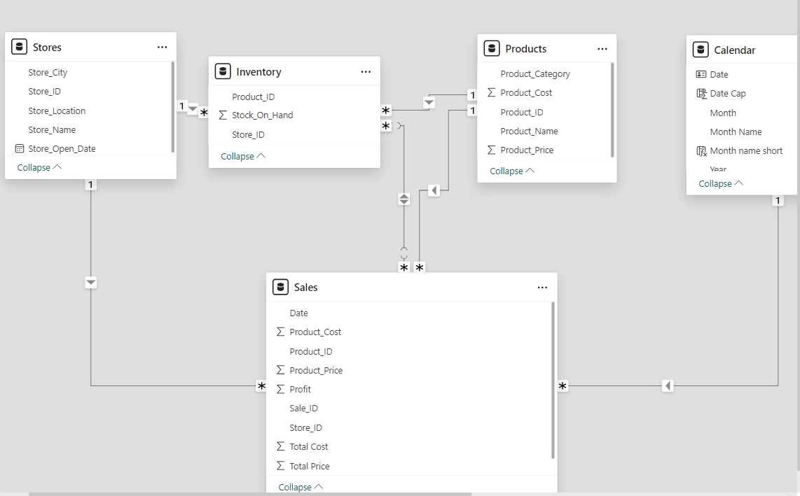
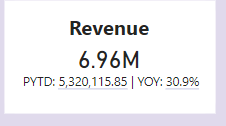
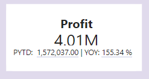

# Maven Toys Shop Sales Performance 

## Introduction
This Power BI project focuses on analyzing the sales performance of a fictional toy store named **Maven Toys**. The goal is to derive insights and address key questions to support the store owner in making data-driven decisions.

**_Disclaimer**:_This project uses a simulated dataset and is not associated with any real company or institution._

## Skills/Concepts Demonstrated
The following Power Bi features were utilized:
- Modelling,
- Power Query
- Filters,
- Page Navigation,
- DAX,
- Quick Measures,
- Tooltips,
- Buttons.

## ABOUT THE DATASET

This dataset contains 4 tables, in CSV format:
- The Products table contains the 35 products sold at Maven Toys (each record represents
one product), with fields containing details about the product category, cost, and retail price
- The Stores table contains the 50 Maven Toys store locations (each record represents one
store), with fields containing details about the store location, type, and date it opened
- The Sales table contains the units sold in over 800,000 sales transactions from January
2017 to October 2018 (each record represents the purchase of a specific product at a specific
store on a specific date)
- The Inventory table contains over 1,500 records that represent the stock on hand of each
product in each store at the current point in time (Oct 1, 2018)

## Recommended Analysis
1.  Which product categories drive the biggest profits? Is this the same across
store locations?
2.  Can you find any seasonal trends or patterns in the sales data?

## Modelling

Automatically generated relationships are modified to remove unwanted connections and replace them with the desired ones. The model created for this analysis is a star schema. 
A star schema is a type of dimensional model where data is structured with a central fact table(Sales table) surronded by multiple dimension tables.

## Data analysis - insights and recommendations

1.	What is our year-over-year (YOY) revenue and profit growth? How did we perform in the previous year?

A YOY comparison is a valuable method for assessing the financial performance of Maven Toys by analyzing revenue and profit for the same period in the current year compared to the previous year. In this analysis, the time frame considered is January to September for both years.
Revenue         | Profit
:---------------: | :---------------: 
 | 

In 2023, Maven Toys achieved $6.96 million in revenue during the specified period, marking a 30.9% year-over-year increase compared to the $5.32 million generated in the same timeframe in 2022. Profits for 2023 reached $1.82 million, reflecting a 16% growth from the $1.57 million recorded in the prior year. Cumulatively, from January 2022 to September 2023, Maven Toys generated $14.44 million in revenue and $3.39 million in total profit.

## Visualization

The report comprises 3 pages:
1. Overview
2. Product
3. Stores

