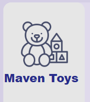

# Maven-Toyshop-Analysis

## Introduction
This Power BI project focuses on analyzing the sales performance of a fictional toy store named **Maven Toys**. The goal is to derive insights and address key questions to support the store owner in making data-driven decisions.

**_Disclaimer**_: _This project uses a simulated dataset and is not associated with any real company or institution._
